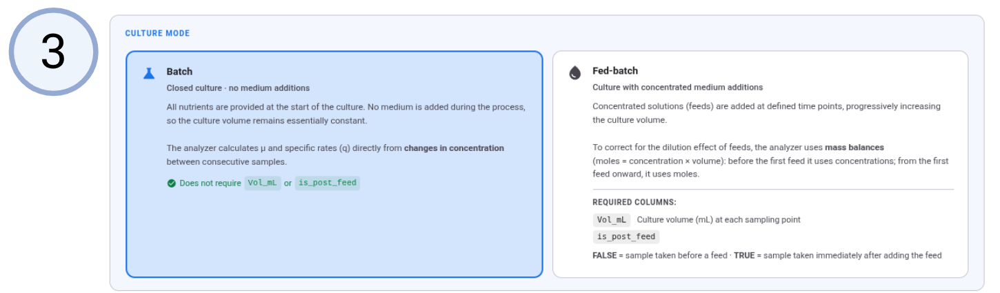
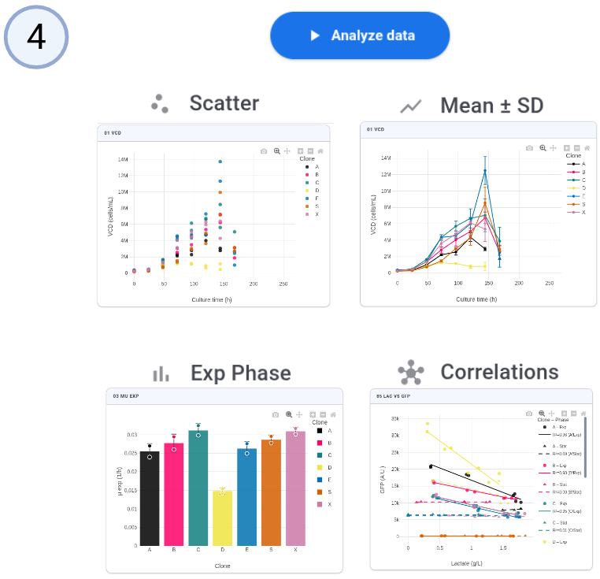

<div align="center">

# Clonalyzer 2

### From raw CSV to publication-ready kinetics — in seconds, entirely in your browser

<br>

**[→ Open the live app](https://ebalderasr.github.io/Clonalyzer-2/)**

<br>

[]()
[]()
[](./LICENSE)
[](https://github.com/ebalderasr)

</div>

---

## What is Clonalyzer 2?

Clonalyzer 2 is a **browser-based kinetics analysis tool** for CHO fed-batch cultures. Drop a raw measurement CSV and it computes over 20 kinetic parameters — specific rates, metabolic yields, integral cell counts — then renders interactive charts and packages everything into a downloadable ZIP or a PDF report ready to paste into your lab notebook.

It runs entirely in the browser through [Pyodide](https://pyodide.org), the full scientific Python stack compiled to WebAssembly. **No installation. No scripts. No data ever leaves your machine.**

---

## Why it matters

After each fed-batch run, extracting kinetic parameters from viability counter and metabolite analyzer data typically means hours of manual spreadsheet work — repeated for every clone and replicate. Without a dedicated tool:

- Specific rates must be calculated interval by interval from raw concentration and volume data
- Feed events require manual correction to avoid confounding dilution with cellular activity
- Clone comparisons and replicate statistics are assembled by hand from separate files

Clonalyzer 2 automates the entire pipeline in a single CSV drop. What used to take an afternoon now takes under a minute.

---

## How it works

Four steps. No command line. No configuration files.

<br>

**Step 1 — Upload your data**

Drag your CSV onto the drop zone or click to browse. The app accepts European decimal commas and automatically detects the column layout.


<br>

**Step 2 — Set the exponential phase window**

Define the start and end time (h) of the exponential growth phase. Specific rates (µ, q values) are summarized separately for the exponential and stationary phases. Default: 0–96 h.


<br>

**Step 3 — Choose your culture mode**

Select **Lote** (batch) for concentration-based calculations, or **Lote alimentado** (fed-batch) to enable the hybrid mass-balance approach that automatically switches from concentration-based to mass-balance at the first feed event.



<br>

**Step 4 — Analyze and explore**

Click **Analyze data**. In seconds you get four families of interactive charts — scatter, mean ± SD, exponential-phase bar plots, and pairwise correlations. Download everything as a ZIP or generate a compact PDF report for your lab notebook.



<br>

---

## Methods

Clonalyzer 2 computes specific rates interval by interval between consecutive timepoints using a trapezoidal approximation. Two scenarios are supported depending on whether culture volume data are available.

### Specific growth rate

μ is always calculated from viable cell density, regardless of the volume scenario:

$$\mu = \frac{\ln(VCD_2 / VCD_1)}{\Delta t} \quad \text{[h}^{-1}\text{]}$$

> Using total cell counts (TC = VCD × V) for μ would produce artefactual negative values whenever volume drops during sampling. VCD is the correct basis.

---

### Scenario A — Constant volume (concentration-based)

Used in **Lote** mode or when `Vol_mL` is absent. Rates are normalized by the **Integral Viable Cell Density (IVCD)**:

$$\Delta IVCD = \frac{VCD_1 + VCD_2}{2} \cdot \Delta t \quad \left[\frac{\text{cells} \cdot \text{h}}{\text{mL}}\right]$$

The specific rate of metabolite $i$ is the concentration change per unit of biomass exposure:

$$q_i = \frac{\Delta C_i}{\Delta IVCD} \quad \text{[pg or pmol / cell / day]}$$

| Parameter | Numerator | Sign convention |
|---|---|---|
| qGlc | $Glc_1 - Glc_2$ | + consumed, reported as pmol/cell/day |
| qLac | $Lac_2 - Lac_1$ | + produced, reported as pmol/cell/day |
| qP | $rP_2 - rP_1$ | + produced |
| qGln | $Gln_1 - Gln_2$ | + consumed, reported as pmol/cell/day |
| qGlu | $Glu_2 - Glu_1$ | + produced, reported as pmol/cell/day |

Metabolic yields are the ratio of concentration changes:

$$Y_{Lac/Glc} = \frac{Lac_2 - Lac_1}{Glc_1 - Glc_2} \quad Y_{Glu/Gln} = \frac{Glu_2 - Glu_1}{Gln_1 - Gln_2}$$

---

### Scenario B — Variable volume (mass-balance)

Used in **Lote alimentado** mode when `Vol_mL` is present. Volume changes between timepoints — due to sampling, evaporation, or feeding — are accounted for explicitly via a mass balance.

**Total viable cells** in the reactor at each timepoint:

$$TC = VCD \times V \quad \text{[cells]}$$

**Integral Total Viable Cells (ITVC):**

$$\Delta ITVC = \frac{TC_1 + TC_2}{2} \cdot \Delta t \quad \text{[cells} \cdot \text{h]}$$

**Total mass** of each metabolite in the reactor:

$$M_i = C_i \times \frac{V}{1000} \quad \text{[g or mmol]}$$

The specific rate is the change in total mass normalized by ITVC:

$$q_i = \frac{\Delta M_i}{\Delta ITVC} \quad \text{[pg or pmol / cell / day]}$$

| Parameter | Numerator | Sign convention |
|---|---|---|
| qGlc | $M_{Glc,1} - M_{Glc,2}$ | + consumed, reported as pmol/cell/day |
| qLac | $M_{Lac,2} - M_{Lac,1}$ | + produced, reported as pmol/cell/day |
| qP | $M_{rP,2} - M_{rP,1}$ | + produced |
| qGln | $M_{Gln,1} - M_{Gln,2}$ | + consumed, reported as pmol/cell/day |
| qGlu | $M_{Glu,2} - M_{Glu,1}$ | + produced, reported as pmol/cell/day |

Metabolic yields are the ratio of mass changes:

$$Y_{Lac/Glc} = \frac{M_{Lac,2} - M_{Lac,1}}{M_{Glc,1} - M_{Glc,2}} \quad Y_{Glu/Gln} = \frac{M_{Glu,2} - M_{Glu,1}}{M_{Gln,1} - M_{Gln,2}}$$

---

### Fed-batch hybrid correction

In **Lote alimentado** mode the engine applies a **two-phase strategy per Clone × Replicate**:

1. **Before the first feed event** (`is_post_feed` is always `FALSE`): the culture behaves as a batch — concentration-based calculations are used because volume changes only reflect sampling, not dilution from feed addition.
2. **From the first feed event onwards** (`is_post_feed` transitions to `TRUE`): the mass-balance approach is activated to correctly decouple feed dilution from cellular activity.

Intervals where `is_post_feed` transitions from `FALSE` to `TRUE` (the actual feed addition point) are always excluded from rate calculations, as the apparent concentration change reflects medium addition rather than cellular metabolism.

---

## Features

| | |
|---|---|
| **Zero installation** | Runs fully client-side via Pyodide — no Python, no pip, no server |
| **20+ kinetic parameters** | µ, qGlc, qLac, qP, qGln, qGlu, yields, IVCD/ITVC, fluorescence kinetics |
| **Batch & fed-batch modes** | Concentration-based (Lote) or hybrid mass-balance (Lote alimentado) with automatic phase detection |
| **4 interactive plot families** | Scatter · Mean ± SD · Exponential phase bars · Correlations |
| **Configurable phase window** | Set exponential phase start and end independently |
| **Custom correlations** | Build any pairwise plot on demand, segmented by clone and phase |
| **PDF reports** | Full report (A4 landscape, one chart per page) or compact report (Letter portrait, 8 charts per page) with the Clonalyzer logo — ready to paste into a lab notebook |
| **ZIP download** | All CSVs and PNGs packaged in one click |
| **No data upload** | Everything runs locally in your browser — your experimental data never leaves your machine |

---

## Input format

### Required columns

| Column | Description | Units |
|---|---|---|
| `t_hr` | Culture time | h |
| `Clone` | Clone identifier | — |
| `Rep` | Biological replicate number | — |
| `is_post_feed` | `TRUE` if sampled after a feed event | boolean |
| `VCD` | Viable cell density | cells/mL |
| `DCD` | Dead cell density | cells/mL |
| `Viab_pct` | Viability | % |
| `rP_mg_L` | Recombinant protein titer | mg/L |
| `Glc_g_L` | Glucose | g/L |
| `Lac_g_L` | Lactate | g/L |
| `Gln_mM` | Glutamine | mM |
| `Glu_mM` | Glutamate | mM |

Two CSV layouts are accepted:

**With metadata row** *(default — keep "Skip first row" checked)*
```
Culture time (h),  Clone ID,  Biological replicate, ...   ← ignored
t_hr,              Clone,     Rep,                  ...   ← column names
0,                 Control,   1,                    ...   ← data
```

**Without metadata row** *(uncheck "Skip first row")*
```
t_hr,  Clone,  Rep,  ...   ← column names
0,     Control,  1,  ...   ← data
```

> European decimal commas (`1,5`) are accepted and converted automatically.

### Optional columns

If present, the corresponding features are enabled automatically.

| Column | Description |
|---|---|
| `Vol_mL` | Culture volume (mL) — required for Lote alimentado mass-balance mode |
| `GFP_mean` / `GFP_std` | GFP fluorescence intensity (A.U.) |
| `TMRM_mean` / `TMRM_std` | TMRM fluorescence intensity (A.U.) |
| `Bodipy_mean` / `Bodipy_std` | BODIPY fluorescence intensity (A.U.) |
| `CellROX_mean` / `CellROX_std` | CellROX fluorescence intensity (A.U.) |

---

## Tech stack

**Analysis (in-browser via WebAssembly)**


**Frontend**


**Packaging & export**


---

## Project structure

```
Clonalyzer-2/
├── index.html          ← markup and UI
├── style.css           ← Material Design 3 custom styles
├── app.js              ← Pyodide init, UI logic, ZIP/PDF generation
├── clonalyzer.py       ← analysis pipeline (runs in-browser via Pyodide)
└── Fig/                ← screenshot assets for this README
```

---

## Author

**Emiliano Balderas Ramírez**
Bioengineer · PhD Candidate in Biochemical Sciences
Instituto de Biotecnología (IBt), UNAM

[](https://www.linkedin.com/in/emilianobalderas/)
[](mailto:ebalderas@live.com.mx)

---

## Related

[**CellSplit**](https://github.com/ebalderasr/CellSplit) — Neubauer cell counting and passage planning for CHO cultures.

[**CellBlock**](https://github.com/ebalderasr/CellBlock) — shared biosafety cabinet scheduling for cell culture research groups.

---

<div align="center"><i>Clonalyzer 2 — drop a CSV, get your kinetics.</i></div>
