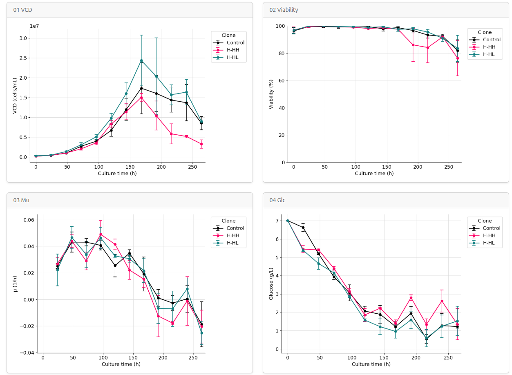
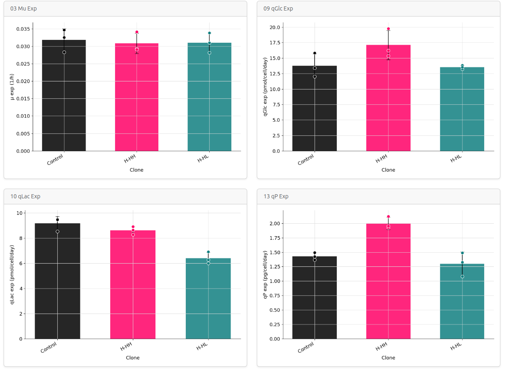

<div align="center">

# ⚗ Clonalyzer 2

### Browser-based kinetics analysis for CHO fed-batch cultures

**Upload a CSV → get publication-ready plots and data tables — in your browser, no installation required.**

[](https://ebalderasr.github.io/Clonalyzer-2/)
[](https://pyodide.org)
[](LICENSE)

</div>

---

## Why Clonalyzer?

Cell line development for therapeutic protein production is a data-intensive process. After each fed-batch run, scientists must extract dozens of kinetic parameters — specific growth rates, metabolite consumption and production rates, yields, integral cell counts — from raw viability counter and metabolite analyzer data. This typically means hours of manual spreadsheet work per experiment, repeated for every clone and replicate.

**Clonalyzer 2 automates this entire pipeline.** Drop in your raw measurement CSV, set your exponential phase window, and within seconds you have:

- Time-resolved kinetic profiles for every clone and replicate
- Mean ± SD comparisons across biological replicates
- Exponential-phase summary statistics ready for clone ranking
- Pairwise correlation analysis between any two parameters
- A ZIP with all processed data and plots, ready for reports or publications

No Python environment to set up, no scripts to run. It works in any modern browser through [Pyodide](https://pyodide.org) — the full scientific Python stack compiled to WebAssembly.

---

## Gallery

<table>
<tr>
<td align="center" width="50%">

**Time-resolved profiles — Mean ± SD**

<sub>Growth, viability, specific growth rate and glucose consumption across culture time for three CHO clones (n = 3 biological replicates). Error bars = ± 1 SD.</sub>

</td>
<td align="center" width="50%">

**Exponential phase summary**

<sub>Clone-level comparison of exponential-phase parameters. Bars = mean ± SD; dots = individual replicates. Enables rapid identification of high-productivity, metabolically efficient clones.</sub>

</td>
</tr>
</table>

---

## Features

| | |
|---|---|
| **Zero installation** | Runs fully client-side via Pyodide — no Python, no pip, no server |
| **Batch & fed-batch** | Feed events handled automatically via `is_post_feed` flag |
| **Configurable phase window** | Set exponential phase start and end independently |
| **20+ kinetic parameters** | μ, qGlc, qLac, qP, qGln, qGlu, yields, IVCD, dGFP/dt, dTMRM/dt |
| **4 plot families** | Scatter · Mean ± SD · Exponential phase bars · Correlations |
| **Custom correlations** | Build any pairwise plot on demand, segmented by clone and phase |
| **Download ZIP** | All CSVs and PNGs packaged in one click |

---

## Getting started

1. Open **[ebalderasr.github.io/Clonalyzer-2](https://ebalderasr.github.io/Clonalyzer-2/)**
2. Wait ~30 s on first load while Python downloads (cached for the rest of the session)
3. Set the exponential phase window (default: 0 – 96 h)
4. Toggle **Skip first row** if your CSV has a metadata header
5. Drag & drop your CSV or click to browse
6. Explore results in the tabbed viewer
7. Click **Download results (.zip)** to export everything

---

## Input format

### CSV structure

The tool accepts two layouts:

**With metadata row** *(default — "Skip first row" ✓)*
```
Culture time (h),  Clone ID,  Biological replicate, ...   ← ignored
t_hr,              Clone,     Rep,                  ...   ← column names
0,                 Control,   1,                    ...   ← data
```

**Without metadata row** *(uncheck "Skip first row")*
```
t_hr,  Clone,  Rep,  ...   ← column names
0,     Control,  1,  ...   ← data
```

### Required columns

| Column | Description | Units |
|---|---|---|
| `t_hr` | Culture time | h |
| `Clone` | Clone identifier | — |
| `Rep` | Biological replicate number | — |
| `is_post_feed` | `TRUE` if sampled after a feed event | boolean |
| `VCD` | Viable cell density | cells/mL |
| `DCD` | Dead cell density | cells/mL |
| `Viab_pct` | Viability | % |
| `rP_mg_L` | Recombinant protein titer | mg/L |
| `Glc_g_L` | Glucose | g/L |
| `Lac_g_L` | Lactate | g/L |
| `Gln_mM` | Glutamine | mM |
| `Glu_mM` | Glutamate | mM |
| `Vol_mL` | Culture volume | mL |

### Optional columns

If present, fluorescence kinetics plots and correlation panels are generated automatically.

| Column | Description |
|---|---|
| `GFP_mean` / `GFP_std` | GFP fluorescence intensity (A.U.) |
| `TMRM_mean` / `TMRM_std` | TMRM fluorescence intensity (A.U.) |

> European decimal commas (`1,5`) are accepted and converted automatically.

---

## Methods

### Trapezoid cell average

All specific rates normalize by the average viable cell count between two consecutive timepoints:

$$\bar{N} = \frac{1}{2}\left(VCD_1 \cdot V_1 + VCD_2 \cdot V_2\right) \times 10^3 \quad \text{[cells]}$$

### Specific rates

| Parameter | Formula | Units |
|---|---|---|
| μ | ln(VCD₂/VCD₁) / Δt | h⁻¹ |
| qGlc | Δ(Glc·V) / Δt / N̄ ÷ MW | pmol/cell/day |
| qLac | Δ(Lac·V) / Δt / N̄ ÷ MW | pmol/cell/day |
| qGln | Δ(Gln·V) / Δt / N̄ | pmol/cell/day |
| qGlu | Δ(Glu·V) / Δt / N̄ | pmol/cell/day |
| qP | Δ(rP·V) / Δt / N̄ | pg/cell/day |
| Y Lac/Glc | Δ(Lac·V) / Δ(Glc·V) | g/g |
| Y Glu/Gln | Δ(Glu·V) / Δ(Gln·V) | mol/mol |
| IVCD | ∫VCD dt (cumulative trapezoid) | cells·h/mL |

### Fed-batch correction

Intervals crossing a feed event (`is_post_feed` transition) are excluded from rate calculations. The apparent change in metabolite concentrations at that point reflects medium dilution, not cellular activity. Volume-corrected mass balances (S × V) handle dilution effects in all other intervals.

### Phase classification

| Phase | Criterion |
|---|---|
| Exponential | t_start ≤ t_hr ≤ t_end *(configurable, default 0–96 h)* |
| Stationary | all other timepoints |

### Plot conventions

| Element | Encoding |
|---|---|
| Color | Clone |
| Marker | ● Exponential phase · ▲ Stationary phase |
| Regression line | Solid = Exponential · Dashed = Stationary |
| Error bars | ± 1 SD across biological replicates |

---

## Output

```
clonalyzer_results.zip
├── data_kinetics_processed.csv      ← all computed parameters, one row per sample
├── data_exp_phase_summary.csv       ← per clone × replicate exponential-phase means
└── plots/
    ├── 01_scatter/                  ← individual data points coloured by clone
    ├── 02_lines/                    ← mean ± SD with error bars
    ├── 03_bars_exp_phase/           ← clone comparison bar charts
    └── 04_correlations/             ← pairwise correlations by clone × phase
```

---

## Project structure

```
Clonalyzer-2/
├── index.html       ← markup only (Bootstrap 5)
├── style.css        ← all custom styles
├── app.js           ← Pyodide init, UI logic, ZIP generation
├── clonalyzer.py    ← analysis pipeline (runs in-browser via Pyodide)
└── Fig/             ← screenshot assets for this README
```

The entire analysis runs client-side. No data leaves your machine.

---

## Tech stack

**Frontend**


**Analysis (in-browser)**


**Packaging**


Fully static — no backend, no server, no installation. All computation runs client-side via WebAssembly. No data leaves your machine.

---

## Author

**Emiliano Balderas Ramírez**
Bioengineer · PhD Candidate in Biochemical Sciences
Instituto de Biotecnología (IBt), UNAM

[](https://www.linkedin.com/in/emilianobalderas/)
[](mailto:ebalderas@live.com.mx)

---

## Related

[**Clonalyzer**](https://github.com/ebalderasr/clonalyzer) — command-line version of the same pipeline, for scripted or batch workflows.

